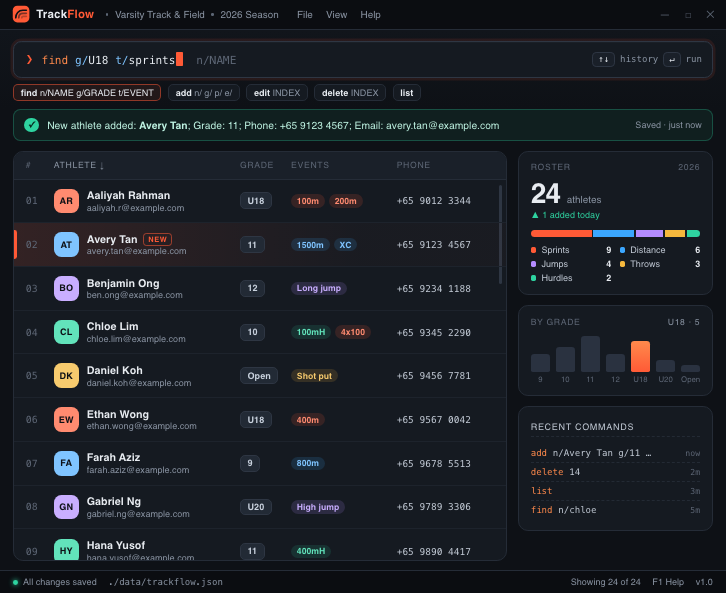

# TrackFlow

**TrackFlow** is a lightning-fast, keyboard-driven roster and contact manager designed specifically for **track and field head and assistant coaches**. It eliminates spreadsheet clutter and chaotic team chat apps by consolidating student-athlete event groups, parent emergency details, relay teams, and performance milestones into split-second CLI commands.

While it has a Graphical User Interface (GUI), most user interactions occur using a Command Line Interface (CLI). It is strictly optimized for touch-typist coaches working at a desk between practices and meets who strongly prefer rapid, keyboard-driven text entry over navigating nested GUI drop-downs and bloated sports-management web platforms.

### Key Features

* **Age-category filtering**: Use `filter a/Under 14` to display matching athletes and their count; `list` restores the full roster.
* **Flexible athlete search**: Search partial values across names, age categories, contact details, addresses, remarks,
  and tags (e.g., `find ave`, `find 9123`, or `find sprint`).
* **Guardian & Emergency Contact Linking**: Map student-athlete cards directly to parent/guardian profiles, enabling single-command lookups of emergency numbers during road meets.
* **Relay Squads & Event Grouping**: Easily organize athletes into designated relay squads (e.g., `group g/4x100mA c/1,4,7,12`), track specific relay legs, and log alternate runners.
* **Personal Best (PB) & Status Logs**: Attach quick, appendable text logs directly to contact profiles for at-a-glance reviews of performance milestones and medical flags during meet sign-ups.

### Documentation
For detailed instructions on how to use and develop this application, refer to our project website:
* **[User Guide](https://ay2627s1-cs2103t-t17-2.github.io/tp/UserGuide.html)**
* **[Developer Guide](https://ay2627s1-cs2103t-t17-2.github.io/tp/DeveloperGuide.html)**

### Acknowledgments
* This project is based on the AddressBook-Level3 project created by the [SE-EDU initiative](https://se-education.org).
