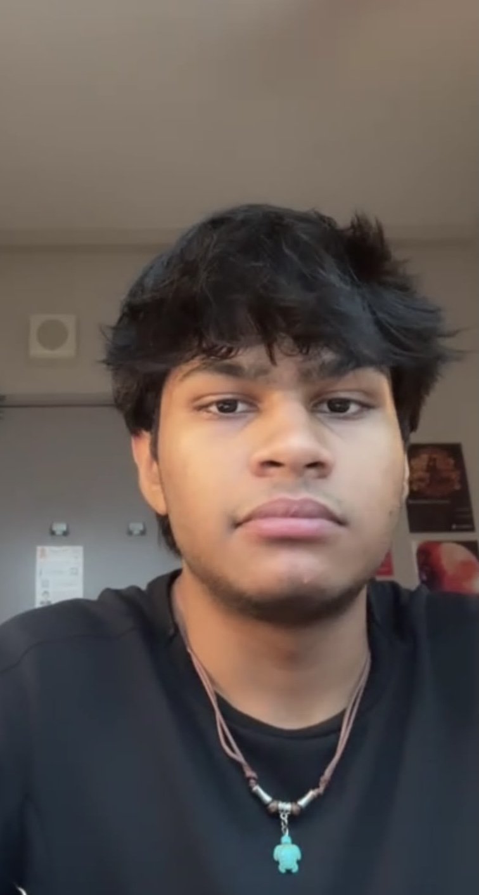

# About Us

We are a team based in the [School of Computing, National University of Singapore](http://www.comp.nus.edu.sg).

You can reach us at the email `seer[at]comp.nus.edu.sg`

## Project team

### Kenil

[[github](https://github.com/ken2k7)]

### Kong Qi Yuan

[[github](http://github.com/qiyuannn)]
[[portfolio](team/johndoe.md)]

* Role: Testing
* Responsibilities: Ensures the testing of the project is done properly and on time.

### Chetan

[[github](http://github.com/chetangent)]
* Role: Team lead
* Responsibilities: Responsible for overall project coordination.

### Austin Chia

[[github](https://github.com/austin-chia)]

* Role: Developer
* Responsibilities: Dev Ops + Threading

### Antony Dennis Chakola

[[github](https://github.com/antonydchakola-hub)]
[[portfolio](team/johndoe.md)]

* Role: Deliverables and deadlines expert
* Responsibilities: Ensures project deliverables are done on time and in the right format.